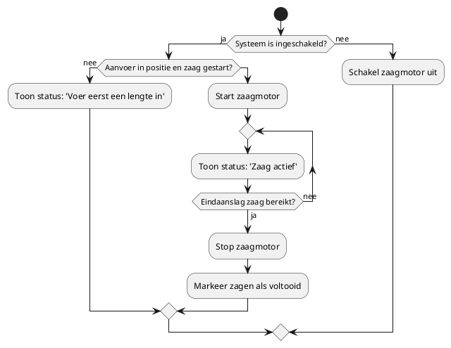
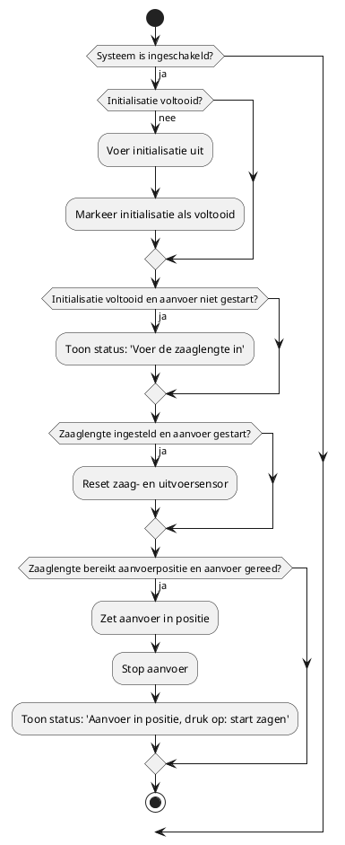

# Chapter 1

```plantuml


@startuml Zagen
 
start
if (Systeem is ingeschakeld?) then (ja)
  
    if (Aanvoer in positie en zaag gestart?) then (nee)
        :Toon status: 'Voer eerst een lengte in';
    else
        :Start zaagmotor;
        repeat
            :Toon status: 'Zaag actief';
        repeat while (Eindaanslag zaag bereikt?) is (nee) not (ja)
            :Stop zaagmotor;
            :Markeer zagen als voltooid;
       
    endif

else (nee)
    :Schakel zaagmotor uit;
endif
@enduml

```

```plantuml
@startuml In- en uitvoer

start
if (Systeem is ingeschakeld?) then (ja)

    if (Initialisatie voltooid?) then (nee)
      :Voer initialisatie uit;
      :Markeer initialisatie als voltooid;
    endif

    if (Initialisatie voltooid en aanvoer niet gestart?) then (ja)
      :Toon status: 'Voer de zaaglengte in';
    endif

    if (Zaaglengte ingesteld en aanvoer gestart?) then (ja)
      :Reset zaag- en uitvoersensor;
    endif

    if (Zaaglengte bereikt aanvoerpositie en aanvoer gereed?) then (ja)
      :Zet aanvoer in positie;
      :Stop aanvoer;
      :Toon status: 'Aanvoer in positie, druk op: start zagen';
    endif

    stop
endif
@enduml
```