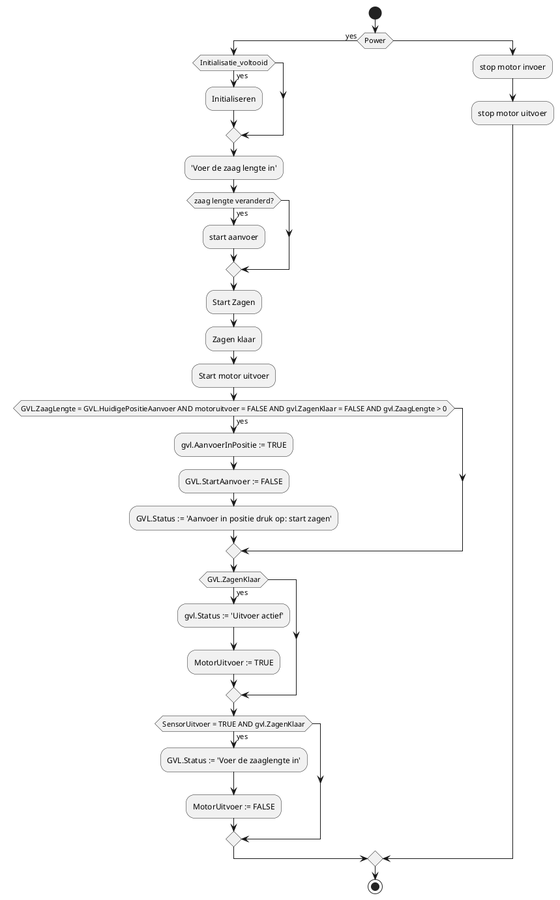

# Chapter 1

```plantuml

@startuml Flowchart in en uitvoer

start

if (Power) then (yes)
  
  if (Initialisatie_voltooid) then (yes)
    :Initialiseren;
  endif
  
  
    :'Voer de zaag lengte in';
    If (zaag lengte veranderd?) then (yes)
    :start aanvoer;
    endif

    :Start Zagen;

    :Zagen klaar;
    :Start motor uitvoer;

  if (GVL.ZaagLengte = GVL.HuidigePositieAanvoer AND motoruitvoer = FALSE AND gvl.ZagenKlaar = FALSE AND gvl.ZaagLengte > 0) then (yes)
    :gvl.AanvoerInPositie := TRUE;
    :GVL.StartAanvoer := FALSE;
    :GVL.Status := 'Aanvoer in positie druk op: start zagen';
  endif
  
  if (GVL.ZagenKlaar) then (yes)
    :gvl.Status := 'Uitvoer actief';
    :MotorUitvoer := TRUE;
  endif
  
  if (SensorUitvoer = TRUE AND gvl.ZagenKlaar) then (yes)
    :GVL.Status := 'Voer de zaaglengte in';
    :MotorUitvoer := FALSE;
  endif
  
else
  :stop motor invoer;
  :stop motor uitvoer;
  
endif

stop

@enduml
```