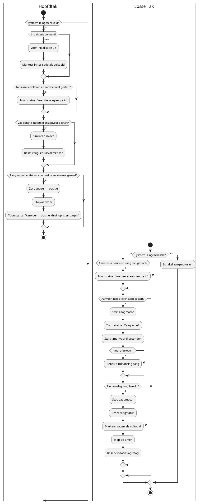

# Chapter 1

```plantuml

@startuml flowchart

|Hoofdtak|
start

if (Systeem is ingeschakeld?) then (ja)
  
  if (Initialisatie voltooid?) then (nee)
    :Voer initialisatie uit;
    :Markeer initialisatie als voltooid;
  endif
  
  if (Initialisatie voltooid en aanvoer niet gestart?) then (ja)
    :Toon status: 'Voer de zaaglengte in';
  endif

  if (Zaaglengte ingesteld en aanvoer gestart?) then (ja)
    :Simuleer invoer;
    :Reset zaag- en uitvoersensor;
  endif
  
  if (Zaaglengte bereikt aanvoerpositie en aanvoer gereed?) then (ja)
    :Zet aanvoer in positie;
    :Stop aanvoer;
    :Toon status: 'Aanvoer in positie, druk op: start zagen';
  endif

  stop

|Losse Tak|
start
if (Systeem is ingeschakeld?) then (ja)

  if (Aanvoer in positie en zaag niet gestart?) then (ja)
    :Toon status: 'Voer eerst een lengte in';
  endif

  if (Aanvoer in positie en zaag gestart?) then (ja)
    :Start zaagmotor;
    :Toon status: 'Zaag actief';
    :Start timer voor 5 seconden;
    
    if (Timer afgelopen?) then (ja)
      :Bereik eindaanslag zaag;
    endif

    if (Eindaanslag zaag bereikt?) then (ja)
      :Stop zaagmotor;
      :Reset zaagstatus;
      :Markeer zagen als voltooid;
      :Stop de timer;
      :Reset eindaanslag zaag;
    endif

  endif

else (nee)
  :Schakel zaagmotor uit;
endif

stop

@enduml


```