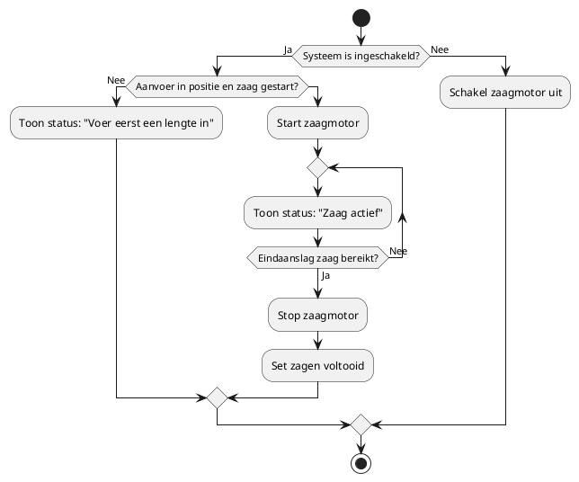
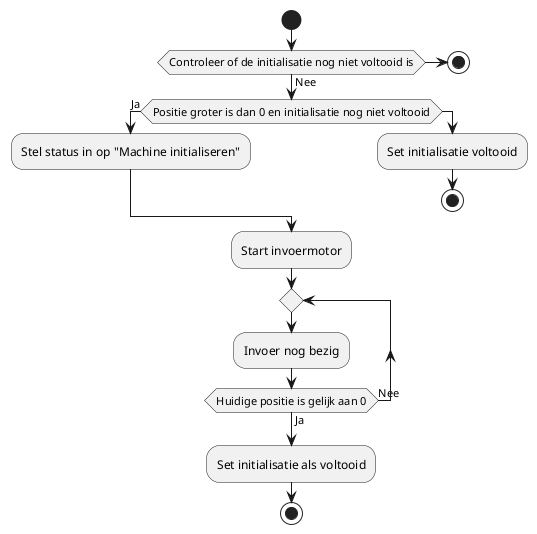

# Individuele eindopdracht

## Introductie
In de flowcharts hieronder wordt de werking van het programma van een zaagmachine beschreven.  De flowcharts zijn opgedeeld in de 2 hoofd taken die samen het volledige proces van het zagen regelen. Daarnaast zijn er ook een aantal functieblokken die in deze taken aangeroepen worden.

1. Taak 1: Zagen Materiaal  
  Deze taak regelt het zagen van het materiaal.

2. Taak 2: In- en Uitvoer van Materiaal  
Deze taak regelt het invoeren van het materiaal. Verder wordt de initialisatie gecontroleerd en eventueel uitgevoerd. Ook wordt vervolgens de uitvoer van het materiaal geregeld. 

3. Functie: Initialiseren Machine
Deze functie gaat over het in de juiste positie zetten van de machine aan het begin van de operatie. Als de machine wordt ingeschakeld, wordt eerst gecontroleerd of de juiste startpositie is bereikt. Zo niet dan wordt de invoer op de juiste positie gezet.

4. functie: Simulatie in- en uitvoer
Deze functie staat niet in een flowchart, maar zit wel in het programma. Dit is gedaan, omdat dit normaal niet in een zaagmachine zit. Dit stukje code is gemaakt om de visualisatie van het programma duidelijker te maken.

## Taak 1: Zagen Materiaal

## Taak 2 in en uitvoer van materiaal.

## Functie initialiseren van de zaagmachine.
