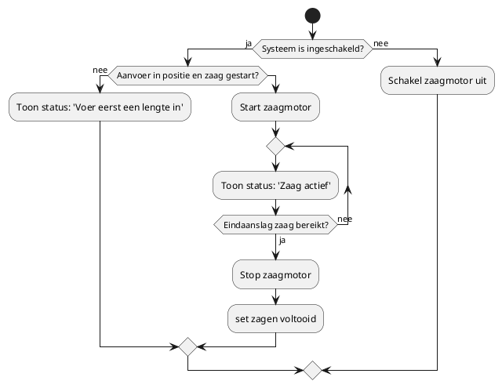
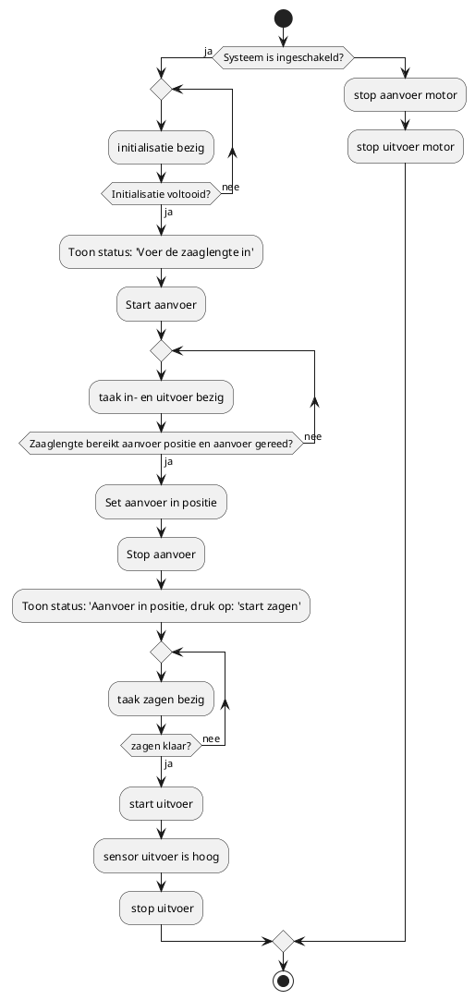
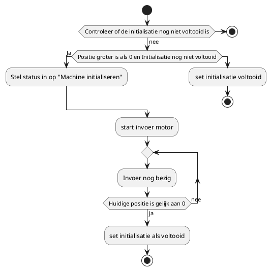

# Chapter 1

## taak 1 zagen materiaal

```plantuml

@startuml Zagen
 
start
if (Systeem is ingeschakeld?) then (ja)
  
    if (Aanvoer in positie en zaag gestart?) then (nee)
        :Toon status: 'Voer eerst een lengte in';
    else
        :Start zaagmotor;
        repeat
            :Toon status: 'Zaag actief';
        repeat while (Eindaanslag zaag bereikt?) is (nee) not (ja)
            :Stop zaagmotor;
            :set zagen voltooid;
       
    endif

else (nee)
    :Schakel zaagmotor uit;
endif
@enduml

```
## taak 2 In en uitvoer van materiaal

```plantuml
@startuml In- en uitvoer

start
if (Systeem is ingeschakeld?) then (ja)
  repeat
  :initialisatie bezig;
  repeat while (Initialisatie voltooid?) is (nee) not (ja)
    
  :Toon status: 'Voer de zaaglengte in';
  :Start aanvoer;

      repeat
    :taak in- en uitvoer bezig;
    repeat while (Zaaglengte bereikt aanvoer positie en aanvoer gereed?) is (nee) not (ja)
      :Set aanvoer in positie;
      :Stop aanvoer;
      :Toon status: 'Aanvoer in positie, druk op: 'start zagen';
    


     repeat
            :taak zagen bezig;
        repeat while (zagen klaar?) is (nee) not (ja)
            :start uitvoer;
    

    :sensor uitvoer is hoog;
    : stop uitvoer; 
  else 
  :stop aanvoer motor;
  :stop uitvoer motor;
  
  endif


stop
@enduml
```

## Functie intialiseren Machine

```plantuml
@startuml initialiseren

start

if (Controleer of de initialisatie nog niet voltooid is) then (nee)


  if (Positie groter is als 0 en Initialisatie nog niet voltooid) then (Ja)
      :Stel status in op "Machine initialiseren";
  else
    : set initialisatie voltooid;
    stop
  endif

    :start invoer motor;
  repeat
   :Invoer nog bezig;
  repeat while (Huidige positie is gelijk aan 0) is (nee) not (ja)
        :set initialisatie als voltooid;

else
stop
endif
stop

@enduml


```